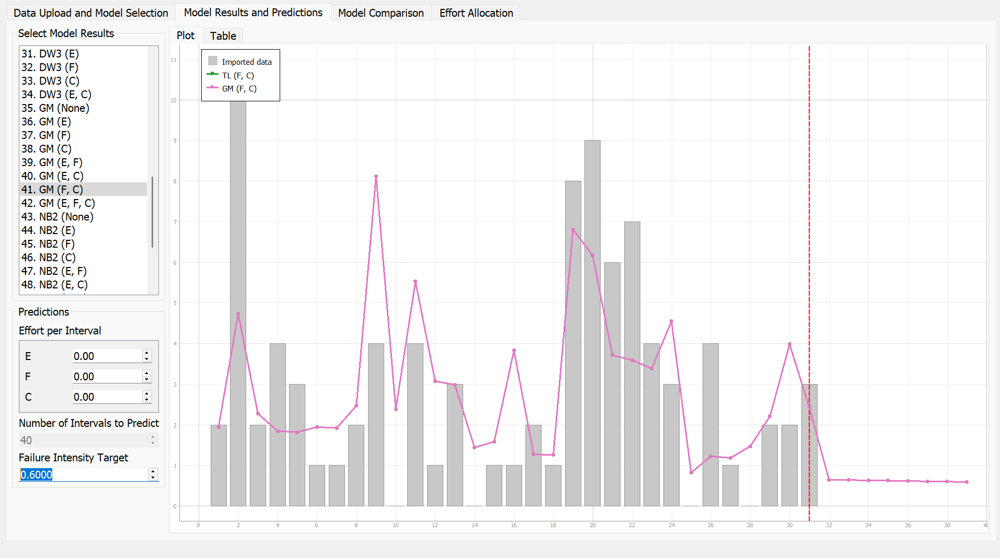
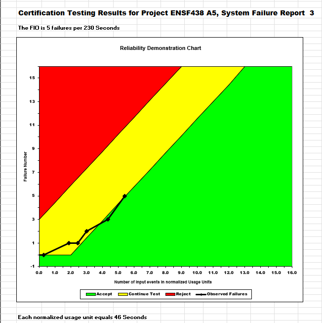
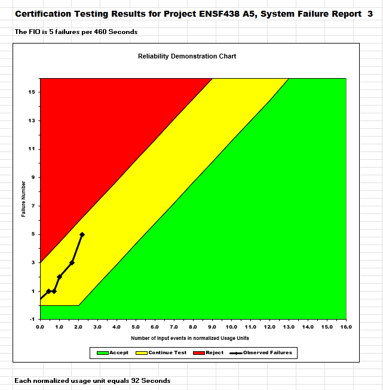
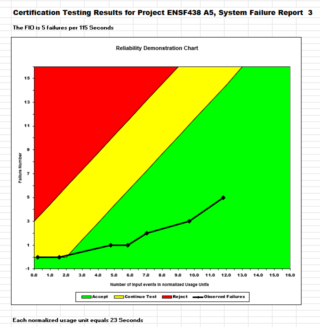

**SENG 438- Software Testing, Reliability, and Quality**

**Lab. Report \#5 – Software Reliability Assessment**

| Group 22:       |   |
|-----------------|---|
| Student Names:  | Issy Gaudet         |
|                 | Kamand Ghorbanzadeh |
|                 | Spiro Douvis        |
|                 | Dylan Wenaas        |

# Introduction

The primary goal of this lab was to introduce us to reliability assessment and demonstrate the use of tools like C-SFRAT and the Reliability Demonstration Chart through Excel. It also covered failure reliability growth testing, which helps track and analyze changes in a product's performance over time. Additionally, we were introduced to the concept of failure data—an essential aspect for identifying and preventing future failures. Overall, this lab reinforced the theoretical concepts discussed in lectures and highlighted the importance of reliability testing within software testing processes.

# Assessment Using Reliability Growth Testing 

## Result of model comparison (selecting top two models)

In this section of the lab assignment, we had to select the best two models using the failure data provided to us the benefit of using the C-SFRAT was that we could simply import the CSV file into this GUI and we could use the functions to determine which fits in well with our data, this feature of Model Results and Predictions it will enable us to narrow which function resembles the closest to the failure data. To approach finding the best two models we select all the possible comparisons we could perform with the covariates. Here we can see all of the models which were selected to see which one would fit the best into our failure data.

To compare these models we selected the Model Comparison tab to present us with a table of all the models, in which we could select the top two models easily.

After analyzing the table, we selected our best-fit models based on log-likelihood values, which reflect how closely a model fits the failure data. A higher (less negative) log-likelihood indicates a better fit. We also considered AIC, BIC, SSE, and Critic scores to support our selection.

**Our two best fit candidates are:**

- Model TL with covariates F, C (Row 57)

- Model GM with covariates F, C (Row 41)

**Both of these models demonstrated:**

- The highest log-likelihood values among all models (−59.653), suggesting they align well with the observed data.

- Low AIC and BIC scores, which indicate a good fit with minimal complexity.

- Strong Critic (Mean and Median) scores close to 1.000, meaning excellent predictive performance.

- Relatively low SSE and PSSE, indicating small prediction errors.

These models use covariates F and C, which may contribute significantly to the failure behavior. Therefore, TL and GM models provide the most reliable statistical representation of our failure dataset.

## Result of range analysis (an explanation of which part of the data is good for proceeding with the analysis)

In our range analysis, we focused on identifying which portion of the failure data would be most appropriate for model fitting. This involved evaluating how well different models captured the behavior of the failure events across the observed time intervals. We used log-likelihood values as our primary indicator of model performance, aiming to find models that closely fit the failure data. The two models with the highest log-likelihoods —Model TL with covariates F, C and Model GM with covariates F, C (both with a log-likelihood of -59.653)— emerged as the best fits. These models not only align well with the failure distribution but also maintain strong performance in other metrics like AIC, BIC, SSE, and Critic scores. In terms of data range, the dataset included 31 intervals, which represent the number of observed failure events over time. This range allowed us to observe a consistent pattern in the failure rates, providing a stable basis for statistical modeling. The distribution within these 31 intervals appeared to be dense and informative enough for the TL and GM models to capture the underlying failure behavior effectively. Therefore, the range of data used was both statistically sufficient and relevant for conducting meaningful reliability analysis.

## Plots for failure rate and reliability of SUT for the test data provided 
MVF Graph for Model 1:

Intensity Graph for Model 1:

MVF Graph for Model 2:

Intensity Graph for Model 2:

Reliability Graph Prediction (C-SFRAT):

## A discussion on decision making given a target failure rate 
To determine the target failure rate, we utilized the C-SFRAT tool to predict future testing intervals and assess system reliability. This tool allowed us to model and visualize the expected failure intensity based on historical data. The failure rate was estimated using the observed number of failures in conjunction with total system operating hours, as derived from the C-SFRAT outputs. This metric was essential in evaluating how much improvement is required in the testing process to meet reliability expectations before system deployment. The goal was to reach the lowest achievable failure rate, ensuring that the observed failure behavior does not pose any critical safety risks to end-users. Based on the C-SFRAT predictions and the intensity graphs (as shown in the image), we selected a target failure intensity of 0.6. This value represented the minimum observed intensity within the relevant intervals of the top-performing model. By aligning testing efforts with this target, the failure data is expected to reflect a system that meets the required reliability standards under test conditions.

## A discussion on the advantages and disadvantages of reliability growth analysis 

**Advantages:**

- The graphs produced by a reliability growth analysis show any time-dependent trends, allowing us to make decisions based on past behavior and predict how our data will behave in the future.
- It is easy to determine and examine the changes at a specific point in time from the results of a reliability growth analysis therefore determine and examine the impact that those changes in the development of the project.

**Disadvantages:**

- The prediction models can differ based on the mathematical functions used in determining a target failure for the system.
- Failure data entry into the Excel files can take a long time to input into the tools for example using the C-SFRAT we had to input the failure data into the Excel file that was already done for us beforehand.

# Assessment Using Reliability Demonstration Chart 

## 3 plots for MTTFmin, twice and half of it for your test data

### RDC for MTTFmin

### RDC for twice MTTFmin

### RDC for half MTTFmin

## Explain your evaluation and justification of how you decide the MTTFmin

To determine the MTTFmin, we used the RDC-11 Excel tool, which plots the system’s failure behavior on a reliability demonstration chart. Our goal was to identify the lowest possible MTTF where the failure points still fall within the acceptable and continue-test regions, based on a specified maximum number of allowable failures.

We began by selecting Failure Report 3, which includes 24 failure times. Since RDC-11 only accepts 16 failure entries, we used the first 16 failures.

To evaluate and determine the minimum acceptable MTTF, we started by using the standard MTTF formula:

MTTF = Total Operating Time / Number of Failures
​
From the failure data, we used 16 failure observations out of the original 24, with the 16th failure occurring at 614 seconds. Using this, we estimated the observed MTTF as:

MTTF = 614 / 16 ≈ 38.4 seconds

Since this value was close to 40, we decided to test whether 40 seconds could be used as a reasonable MTTFmin and used that value as a rough baseline for our trial and error.

To do this in the RDC-11 tool, we worked backward. The tool doesn’t let us input MTTFmin directly, so we used trial and error by adjusting the "Number of Input Events" value in the RDC settings to achieve a normalized usage unit (X-axis) near 40.

We set 'Maximum acceptable number of failures' to 5 and 'Input event description' to seconds (representing system runtime).

We chose 5 failures because this is a reasonable threshold to reflect a system’s performance while still keeping the number of failures manageable for assessing reliability. A lower number of failures allows for a more precise evaluation of the system’s reliability, while higher failure numbers might stretch the system beyond acceptable performance limits. We felt 5 was a fair number of failures to estimate with.

We then adjusted the "Number of Input Events" until we found a setup that provided a good fit for the system's failure behavior. Next, we continued refining our estimate of MTTFmin by further adjusting the "Number of Input Events" value. As we ran multiple trials, we observed how the failure points shifted relative to the acceptable region on the chart. When we set the MTTFmin to 46 seconds, the majority of the failure points fell within the acceptable boundary. However, at smaller values, such as 40 seconds, more failure points fell outside the acceptable region, indicating that the system wouldn't meet the required reliability performance. After several iterations, we found that adjusting the 'Number of Input Events' to 230 yielded the best results. This setup resulted in an estimated MTTFmin of:

Estimated MTTFmin = 230 input events / 5 failures = 46 seconds

Thus, after evaluating multiple trials and observing the trend in the RDC chart, we concluded that an MTTFmin of 46 seconds was the minimum value at which the system demonstrated acceptable reliability, based on our failure data and assumptions in the RDC-11 tool.

## A discussion on the advantages and disadvantages of RDC	

Advantages:

RDC is very versatile, it can be applied to a wide range of systems to evaluate their reliability. It is useful in various industries and for different types of products, making it an adaptable tool. RDC is also very time efficient, its able to conduct reliability analysis in a relatively short period. It is also cost-effective since it doesn't require complex equipment or a large team of experts to implement, especially when using the open-source Excel version of RDC like we used for this assignment. The RDC also allows for experimentation with different values for confidence levels and MTTF. This feature is useful for conducting "what-if" scenarios, where you can analyze how changes in these variables affect the system's reliability. This flexibility helps in decision-making and optimization processes. While RDC cannot provide exact quantitative reliability values, it gives a straightforward way to assess whether a SUT is acceptable or not based on predefined criteria, making it easier to make quick judgments on system performance.

Disadvantages:

A significant drawback of the RDC is that it cannot calculate the precise quantitative reliability or availability of the system being studied. This limits its ability to provide in-depth insights into system performance and long-term reliability. Since RDC only indicates whether the system is acceptable or not based on the predefined confidence levels and MTTF values, it doesn’t provide a full spectrum of reliability metrics. This can be limiting in situations where detailed, quantitative reliability data is required for in-depth analysis.

In conclusion, while RDC offers a versatile, efficient, and cost-effective way to perform reliability assessments, it does come with limitations related to the precision of the results it provides. It is good for quick assessments and scenarios where a simple pass/fail decision is what we want. 

# Comparison of Results

**Comparison**

In the RDC-11 analysis, three normalized usage unit values were evaluated to determine the minimum acceptable MTTF: 23 seconds (115 input events), 46 seconds (230 input events), and 92 seconds (460 input events), all based on a threshold of 5 allowable failures. The chart corresponding to 46 seconds showed all failure points falling within the green and yellow zones, indicating acceptable reliability performance. In contrast, the 23-second chart, while still within the acceptable range, showed points approaching the boundary of the continue-test region, and the 92-second chart revealed several failure points in the red zone, suggesting that the system could not sustain such a high MTTF. This supports the conclusion that 46 seconds is the minimum MTTF at which the system remains reliably operational under the specified failure constraints. In parallel, the Reliability Growth Testing chart provided a temporal view of system improvement, with failure intensity starting above the target threshold of 0.6 and gradually decreasing. The failure intensity curve (GM model) crossed below the 0.6 threshold at approximately interval 30, confirming that the system's reliability improved with continued testing and design refinement. Together, these numerical results reinforce that while 46 seconds is the optimal MTTFmin under current test conditions, ongoing improvements observed through RGT validate the system’s path to achieving and maintaining that reliability standard.

**When to use each technique**

Reliability Growth Testing (RGT) is done to analyze current reliability. In addition, it can be used to identify and eliminate faults, and forecast future reliability. The reliability figures are compared with intermediate reliability objectives to measure progress so that resources can be directed to achieve the reliability goals in a timely and cost-effective manner. Whenever a failure occurs, an action is executed to remove the problem.

Reliability Demonstration Chart (RDC) is done toward the end of the growth testing period to verify that a specific reliability level (FIO) has been achieved. During this stage, the software code is frozen.

# Discussion on Similarity and Differences of the Two Techniques

Both reliability growth testing and reliability assessment using RDC are techniques used to evaluate the reliability of a SUT, and although they share some similarities, they differ significantly in their methodologies and applications.

Similarities
- Both techniques use failure times and more specifically MTTF to assess the system’s performance and reliability.
- Failure data is needed for both methods.
- Both methods used to determine whether the system is becoming more reliable over time, either through improved failure trends or a longer MTTF.
- Both methods requires tools and analysis techniques. Reliability growth testing uses statistical modeling and trend analysis, RDC uses graphical interpretation through tools like RDC-11.

Differences
- The data collection approach is different. In reliability growth testing, failures are continuously monitored and recorded as they occur but for RDC failure data is collected at predefined intervals.
- The analysis method. Reliability growth testing focuses on viewing trends and patterns in failure rates using statistical models, RDC involves plotting cumulative failures against normalized input events to determine if the system falls in the Accept, Reject, or Continue Testing regions.
- In reliability growth testing, both failure counts and inter-failure times are considered to analyze trends over time but RDC focuses on inter-failure times to assess reliability at specific checkpoints.
- Reliability growth testing is more data-intensive and often part of a continuous improvement process, it helps identify and address reliability issues as they appear, RDC is simpler and provides just a pass/fail type decision based on limited failure data.
- Growth testing focuses on predicting reliability trends, and RDC focuses on determining whether the system meets a specific reliability requirement at a point in time.

# How the team work/effort was divided and managed

**Kamand and Spiro:** Kamand and Spiro collaborated on Part 1 of the lab, which focused on reliability growth testing using the C-SFRAT tool. We worked together to analyze the failure data and found the two best models for our data inputs. It was the TL (F,C) and GM (F,C). We also contributed to the discussion on the advantages and disadvantages of reliability growth testing and documented the decision-making process for selecting the appropriate models.

**Isabelle and Dylan:** Isabelle and Dylan worked on Part 2 of the lab, which involved using the Reliability Demonstration Chart (RDC) tool. We determined the MTTFmin through trial and error by adjusting the "Number of Input Events" and setting parameters such as the "Maximum Acceptable Number of Failures." We also created the required plots for MTTFmin, twice MTTFmin, and half MTTFmin, and analyzed the results. Additionally, we contributed to the discussion on the advantages and disadvantages of RDC and documented the challenges encountered during the process.

**Team Collaboration:** The entire team collectively worked on the write-up for the lab report. This included comparing the results of Part 1 and Part 2, discussing the similarities and differences between the two techniques, and reflecting on the lessons learned during the lab. Regular meetings and discussions ensured that all sections were cohesive and well-structured. Each member reviewed the final document to ensure consistency, accuracy, and clarity.

# Difficulties encountered, challenges overcome, and lessons learned

Determining the MTTFmin using the RDC-11 tool had several challenges. The tool doesn’t allow for direct input of MTTFmin, so we had to use trial and error by adjusting the "Number of Input Events" to achieve a normalized usage unit close to our target. One difficulty was selecting the right parameters, such as setting the "Maximum Acceptable Number of Failures" to 5, which we felt was a reasonable value for evaluating reliability without pushing the system’s limits. Refining the MTTFmin estimate was challenging as it required multiple iterations to find the optimal value, with 230 input events producing a normalized usage unit of approximately 46 seconds. It was also hard to determine the best estimate/when to stop since the RDC-11 tool only provides a graph with color coded regions and gives no specific values indicating how accurate or reliable the result was, making it difficult to know how good our estimates were compared to eachother.

Another challenge we faced during the lab was the incompatibility between the required software and macOS. This issue significantly affected our workflow, as only half of our group members were able to run the C-SFRAT software needed to visualize and analyze the data. As a result, it was difficult to collaborate efficiently. To address this limitation, we adopted a peer programming-style approach: the two group members with compatible systems handled data input and visualization using C-SFRAT, while the remaining members focused on analyzing and interpreting the output. This collaborative strategy allowed us to work around the software limitations and complete the lab effectively despite the technical constraints.

# Comments/feedback on the lab itself
To improve the overall experience and efficiency of future labs, it would be beneficial to ensure that all required software is compatible across different operating systems. This would help prevent the technical difficulties we encountered and make the lab more accessible to all students. Additionally, more detailed instructions and guidance on how to use the tools and interpret their outputs would have been extremely helpful. Learning a new tool without proper support is both challenging and time-consuming, often requiring trial and error just to input the data correctly. This process felt inefficient and detracted from the core objectives of the lab. Furthermore, with the workload from other courses, time available for the lab was limited. As a result, we often had to settle for the first set of acceptable results we found, rather than thoroughly exploring for the most accurate or optimal outcomes.